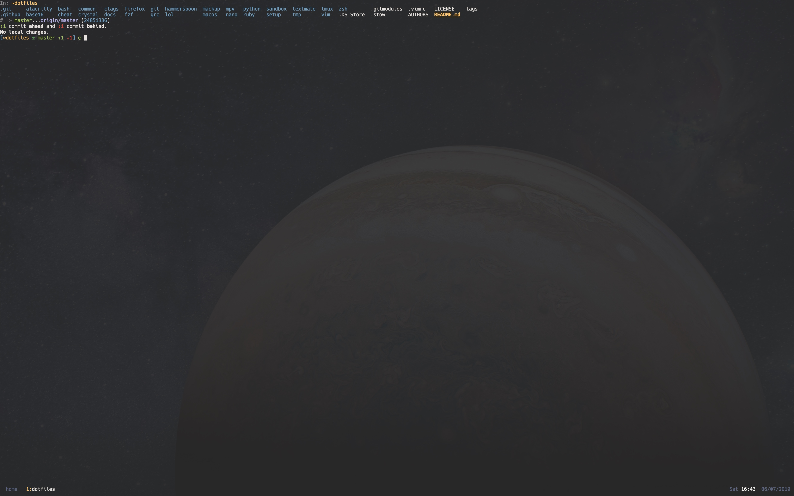
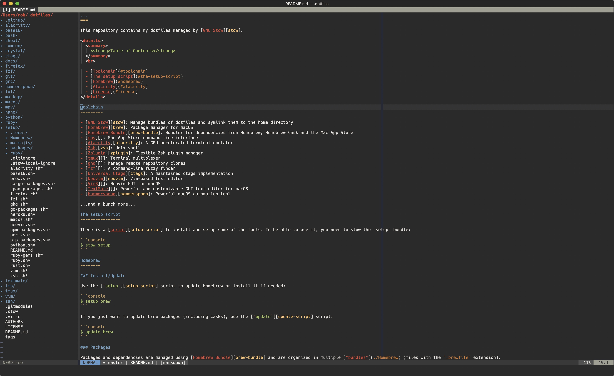

...
===

This repository contains my dotfiles managed by [GNU Stow][stow].

Table of Contents
-----------------

- [Screenshots](#screenshots)
- [Toolchain](#toolchain)
- [The setup script](#the-setup-script)
- [Homebrew](#homebrew)
  - [Install/Update](#homebrew-install-update)
  - [Packages](#homebrew-packages)
- [Alacritty](#alacritty)
  - [Requirements](#alacritty-requirements)
  - [Install/Update](#alacritty-install-update)
- [License](#license)

Screenshots
-----------

<details>
  <summary><strong>Alacritty</strong></summary>

  
</details>

<details>
  <summary><strong>VimR</strong></summary>

  
</details>

Toolchain
---------

- [GNU Stow][stow]: Manage bundles of dotfiles and symlink them to the home directory
- [Homebrew][brew]: Package manager for macOS
- [Homebrew Bundle][brew-bundle]: Bundler for dependencies from Homebrew, Homebrew Cask and the Mac App Store
- [mas][]: Mac App Store command line interface
- [Alacritty][alacritty]: A GPU-accelerated terminal emulator
- [Zsh][zsh]: Unix shell
- [Zplugin][zplugin]: Flexible Zsh plugin manager
- [tmux][]: Terminal multiplexer
- [ghq][]: Manage remote repository clones
- [fzf][]: A command-line fuzzy finder
- [Universal Ctags][ctags]: A maintained ctags implementation
- [Neovim][neovim]: Vim-based text editor
- [VimR][]: Neovim GUI for macOS
- [TextMate][]: Powerful and customizable GUI text editor for macOS
- [Hammerspoon][hammerspoon]: Powerful macOS automation tool

...and a bunch more...

The setup script
----------------

There is a [script][setup-script] to install and setup some of the tools. To be able to use it, you need to stow the "setup" bundle:

```console
$ stow setup
```

Homebrew
--------

<h3 id="homebrew-install-update">Install/Update</h3>

Use the [`setup`][setup-script] script to update Homebrew or install it if needed:

```console
$ setup brew
```

If you just want to update brew packages (including casks), use the [`update`][update-script] script:

```console
$ update brew
```

<h3 id="homebrew-packages">Packages</h3>

Packages and dependencies are managed using [Homebrew Bundle][brew-bundle] and are organized in multiple ["bundles"](./Homebrew) (files with the `.brewfile` extension).

To install a bundle, you need to specify its file to the `brew bundle` command:

```console
$ brew bundle install --file="./Homebrew/common.brewfile"
```

Or you can install all bundles:

```zsh
# In ZSH:
for f in ./Homebrew/*.brewfile(:A); do
  brew bundle install --file="$f"
done
```

Alacritty
---------

[Alacritty][alacritty] is a GPU-accelerated terminal emulator written in Rust.

<h3 id="alacritty-requirements">Requirements</h3>

To install Alacritty, you need to have [ghq][] installed. If you haven't done so already, just run the [`setup`][setup-script] script:

```console
$ setup ghq
```

<h3 id="alacritty-install-update">Install/Update</h3>

Use the [`setup`][setup-script] script to install/update Alacritty:

```console
$ setup alacritty
```

This will do several things:

- Run the Rust [setup script](./setup/rust.sh)
- Clone or update the [Alacritty git repository][alacritty]
- Compile `Alacritty.app`
- Copy the compiled application to `/Applications`
- Generate the Alacritty manpage and copy it to `$XDG_DATA_HOME/man/man1`
- Copy the ZSH and Bash completion files to the right place

You can take a look at the [`alacritty.sh`](./setup/alacritty.sh) if you want to see all the details.

License
-------

<details>
  <summary>
    <a href="http://www.wtfpl.net/" rel="nofollow">WTFPL</a> – Do What the Fuck You Want to Public License
  </summary>
  <br>

```text
            DO WHAT THE FUCK YOU WANT TO PUBLIC LICENSE
                    Version 2, December 2004

 Copyright (C) 2019 Robert Audi

 Everyone is permitted to copy and distribute verbatim or modified
 copies of this license document, and changing it is allowed as long
 as the name is changed.

            DO WHAT THE FUCK YOU WANT TO PUBLIC LICENSE
   TERMS AND CONDITIONS FOR COPYING, DISTRIBUTION AND MODIFICATION

  0. You just DO WHAT THE FUCK YOU WANT TO.
```

</details>

[stow]: https://www.gnu.org/software/stow/
[brew]: https://brew.sh/
[brew-bundle]: https://github.com/Homebrew/homebrew-bundle
[mas]: https://github.com/mas-cli/mas
[alacritty]: https://github.com/jwilm/alacritty
[zsh]: http://zsh.sourceforge.net/
[zplugin]: https://github.com/zdharma/zplugin
[tmux]: http://tmux.github.io/
[ghq]: https://github.com/motemen/ghq
[fzf]: https://github.com/junegunn/fzf
[ctags]: https://ctags.io
[neovim]: https://neovim.io/
[VimR]: http://vimr.org/
[TextMate]: https://macromates.com/
[hammerspoon]: https://www.hammerspoon.org/

[setup-script]: ./setup/.local/bin/setup
[update-script]: ./zsh/.zsh/functions/update
