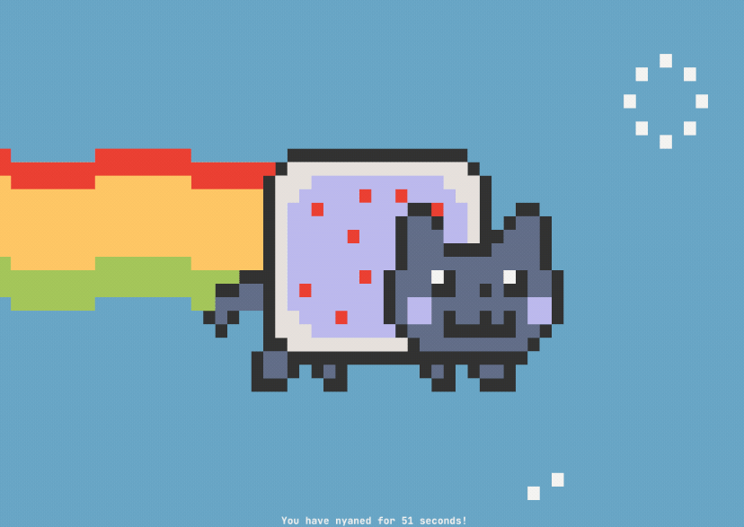

Nyancat CLI
===========

Nyancat rendered in your terminal.



Setup
-----

First build the C application:

```console
$ make && cd src
```

You can run the C application standalone.

```console
$ ./nyancat
```

Licenses, References, etc.
--------------------------

The original source of the Nyancat animation is
[prguitarman](http://www.prguitarman.com/index.php?id=348).

The code provided here is provided under the terms of the
[NCSA license](http://en.wikipedia.org/wiki/University_of_Illinois/NCSA_Open_Source_License).
